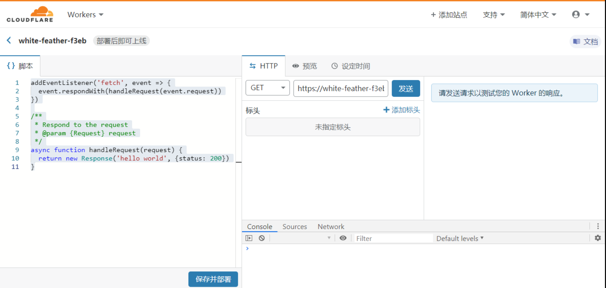

## Install

MiniValine 自 version 6.x 起回归极简主义！ 因此 6.x 移除了 5.x 的全部功能特性，只保留了基础评论功能！！！

> Less is More
------------------------------

!> 注意这里是 MiniValine version 6.x 的安装部署方法

MiniValine 6.x 仅提供了一种安装部署方案，共分为三步，其中第二步可选。

### 安装部署 MiniValine-Admin-API-Vercel【必需】

按照常理，仅需要部署下面要说的 MiniValine-Admin-CFWorker【可选】与 ohhho kernel 【必须】即可，但是 CloudFlareWorker 开发平台存在一些局限性，因此需要额外部署MiniValine-Admin-API-Vercel 以供 MiniValine-Admin-CFWorker【可选】与 ohhho kernel 【必须】调用相关API,另外您可以魔改MiniValine-Admin-API-Vercel已达到自己的需求。

#### 配置Github仓库【必需】

打开 [MiniValine-Admin-API-Vercel](https://github.com/MiniValine/MiniValine-Admin-API-Vercel) 项目页面，点击页面中绿色的 Use this template（使用这个模版）按钮。（瞎点fork按钮发送垃圾 PR 将直接提交到 GitHub 黑名单中拉黑1-36500天）


填写仓库名称，选择Private（私有仓库），然后点击Create repository from template（从模版创建储存库）按钮。（请切记一定要创建私有仓库，否则您的信息和API将处于危险当中！！！）


经过几秒钟的等待，页面会跳转到新建的仓库。

#### 修改 MiniValine-Admin-API-Vercel 源码【可选】

（Q：为什么不使用环境变量，而直接修改源码？A：~强制您创建私有仓库，并~方便开发魔改，~此处强力劝退~）

MiniValine-Admin-API-Vercel 中包含三个模块，需要修改的是 通知邮件发送模块 和 Akismet-API 模块（这两个模块是非必须），其中第三个模块是MiniValine-Admin-CFWorker的必需模块，无需配置这里并不做说明。

如果使用 通知邮件发送模块 和 Akismet-API 模块 必需安装部署 MiniValine-Admin-CFWorker

##### Akismet-API 模块【可选】

> Akismet (Automattic Kismet)是应用广泛的一个垃圾留言过滤系统，其作者是大名鼎鼎的WordPress 创始人 Matt Mullenweg，Akismet也是WordPress默认安装的插件，其使用非常广泛，设计目标便是帮助博客网站来过滤留言Spam。有了Akismet之后，基本上不用担心垃圾留言的烦恼了。 启用Akismet后，当博客再收到留言会自动将其提交到Akismet并与Akismet上的黑名单进行比对，如果名列该黑名单中，则该条留言会被标记为垃圾评论且不会发布。

如果还没有Akismet Key，你可以去 [AKISMET FOR DEVELOPERS](https://akismet.com/development/) 免费申请一个；

打开 api/akismet.js 文件

修改含有xxxxxxx的 key 和 blog 变量

key 即 Akismet Key

blog 即 blog url


##### 通知邮件发送模块【可选】

这里使用的是[nodemailer](https://github.com/nodemailer/nodemailer) 

具体匹配和开发请查阅相关文档：https://nodemailer.com/

打开 api/postmail.js 文件

修改含有xxxxxxx的SITEPATH、AdminEmail、html、 user 、pass、service、from 变量


如果您有其他需要，请自行开发，这里不再提供关于通知和检测垃圾评论的任何支持，我们非常欢迎您分享魔改方案。

#### 将 MiniValine-Admin-API-Vercel 部署到 Vercel【必需】

进入 https://vercel.com/ ，未登录的话需要登录，这里选 Github 登录即可。

然后将您的 MiniValine-Admin-API-Vercel 仓库直接部署到Vercel即可。


部署完成后请记录部署好的网站地址，下面配置会用到。

### 安装部署 MiniValine-Admin-CFWorker【可选】

先下载，你可以直接从[Github](https://raw.githubusercontent.com/MiniValine/MiniValine-Admin-CFWorker/master/dist/worker.js)上下载，也可以用[JSdelivr](https://cdn.jsdelivr.net/gh/MiniValine/MiniValine-Admin-CFWorker@master/dist/worker.js)加速下载，复制里面的内容。

进入[CloudFlare](https://cloudflare.com/),注册账户，开通workers不再阐述。

点击KV选项，进入并创建一个KV桶，命名空间名称随意


新建一个Worker，，修改左上角三级域名【可选】,点击保存并部署。



返回，先配置变量，MiniValine-Admin-CFWorker 使用了 ohhho kernel 的KPI，因此

配置参照 https://github.com/MHuiG/ohhho


其中 APIURL和IPFSAPI填写上一步MiniValine-Admin-API-Vercel获得的部署好的网站地址,APIPATH这里不填，OHHHOPATH填写MiniValine-Admin-CFWorker的路由地址

| 配置项      | 配置说明                                                     |
| ----------- | ------------------------------------------------------------ |
| IPFSAPI     | MiniValine-Admin-API-Vercel获得的部署好的网站地址            |
| AESKEY      | 16位随机字符，建议手滚键盘                                   |
| AUTHEMAIL   | cloudflare 的账户邮箱                                        |
| AUTHKEY     | 用于访问 Cloudflare API 的密钥Global API Key。https://dash.cloudflare.com/profile/api-tokens |
| ZONEID      | cloudflare 的区域 ID，打开域名的概述页面即可看到             |
| ACCOUNTID   | cloudflare 的帐户 ID，打开域名的概述页面即可看到             |
| WORKERNAME  | 该worker脚本的名称                                           |
| WORKERROUTE | 该worker的路由 xxx.xxx.com/*                                 |
| PRIVATEK    | CAPTCHA随机密钥，建议手滚键盘                                |
| PRIVATEPASS | CAPTCHA随机密钥，建议手滚键盘                                |
| CHECKRT     | true表示在有效期内AccessToken永久有效;false表示AccessToken在使用一次后就吊销 |
| CAPTCHAAPI  | 自定义 Captcha 【可选】                                      |
| SITEPATH    | 博客路径                                                     |
| USERNAME    | 管理系统用户名                                               |
| PASSWORD    | 管理系统密码                                                 |
| OHHHOPATH   | 该worker的访问路径                                           |
| APIURL      | MiniValine-Admin-API-Vercel获得的部署好的网站地址            |

注意配置所有路径最后不要加`/`

再划到底下-KV 命名空间绑定-编辑变量-新增变量绑定-变量名称：API【此处不可更改】，KV命名空间：您之前写的空间名字，OHHHO【此处不可更改】，KV命名空间：您之前写的空间名字，如图所示


创建一个每天定时执行的Cron 触发器 例如： 0 16 * * *，时间自定，建议避免和其他人相同，每天执行一次即可。


点击快速编辑将获得的源代码直接复制到里头，


保存并部署。

管理员后台地址：https://xxx.workers.dev/ohhho/

### 安装部署MiniValine客户端【必需】

#### 安装部署 ohhho kernel【必需】

先下载，你可以直接从[Github](https://raw.githubusercontent.com/MHuiG/ohhho/master/worker/dist/worker.js)上下载，也可以用[JSdelivr](https://cdn.jsdelivr.net/npm/ohhho@latest/worker/dist/worker.js)加速下载，复制里面的内容。

新建一个Worker，，修改左上角三级域名【可选】,点击保存并部署。


返回，先配置变量，方法同 MiniValine-Admin-CFWorker，因此

配置参照 https://github.com/MHuiG/ohhho 配置与MiniValine-Admin-CFWorker相同的环境变量。

其中 IPFSAPI填写上一步MiniValine-Admin-API-Vercel获得的部署好的网站地址，APIPATH填上一步MiniValine-Admin-CFWorker的路由地址，OHHHOPATH填写ohhho kernel的路由地址

以下是具体的配置说明

| 配置项      | 配置说明                                                     |
| ----------- | ------------------------------------------------------------ |
| IPFSAPI     | MiniValine-Admin-API-Vercel获得的部署好的网站地址            |
| AESKEY      | 16位随机字符，建议手滚键盘                                   |
| AUTHEMAIL   | cloudflare 的账户邮箱                                        |
| AUTHKEY     | 用于访问 Cloudflare API 的密钥Global API Key。https://dash.cloudflare.com/profile/api-tokens |
| ZONEID      | cloudflare 的区域 ID，打开域名的概述页面即可看到             |
| ACCOUNTID   | cloudflare 的帐户 ID，打开域名的概述页面即可看到             |
| WORKERNAME  | 该worker脚本的名称                                           |
| WORKERROUTE | 该worker的路由 xxx.xxx.com/*                                 |
| PRIVATEK    | CAPTCHA随机密钥，建议手滚键盘                                |
| PRIVATEPASS | CAPTCHA随机密钥，建议手滚键盘                                |
| CHECKRT     | true表示在有效期内AccessToken永久有效;false表示AccessToken在使用一次后就吊销 |
| CAPTCHAAPI  | 自定义 Captcha 【可选】                                      |
| SITEPATH    | 博客路径                                                     |
| USERNAME    | 管理系统用户名                                               |
| PASSWORD    | 管理系统密码                                                 |
| OHHHOPATH   | 该worker的访问路径                                           |
| APIPATH     | MiniValine-Admin-CFWorker的访问路径                          |

注意配置所有路径最后不要加`/`

再划到底下-KV 命名空间绑定-编辑变量-新增变量绑定-变量名称：OHHHO【此处不可更改】，KV命名空间：您之前写的空间名字，如图所示


绑定域名【必需】请注意如果您部署了MiniValine-Admin-CFWorker则必须绑定自己的域名，否则ohhho kernel无法连接MiniValine-Admin-CFWorker（不允许workers.dev连接workers.dev）


此处域名后面必须加`/*`

ohhho kernel 自带了一个简易的管理系统，管理员后台地址：https://xxx.workers.dev/ohhho/ ，不过由于是内核所以没有集成通知邮件发送模块 和 Akismet-API 模块，这意味着MiniValine-Admin-CFWorker的配置是可选的,但是MiniValine-Admin-API-Vercel的配置是必须的。

您可以魔改MiniValine-Admin-CFWorker配置您自己的MiniValine-Admin-CFWorker的功能；这里开发MiniValine-Admin-CFWorker只是举一个例子。

将 ohhho kernel 的路由地址 填写到前端配置的serverURL中即可（这里填写您的自定义域名，填写https://xxx.workers.dev 将无法连接到MiniValine-Admin-CFWorker）

注意：配置项比较多，建议再核对一下配置。【必需】

#### 安装部署前端脚本【必需】

Two ways.

##### Install

- links

```html
<script src="https://cdn.jsdelivr.net/npm/minivaline@latest/dist/MiniValine.min.js"></script>

```

- npm install

``` bash
# Install minivaline
npm install minivaline --save
```

``` js
// Use import
import MiniValine from 'minivaline';
// or Use require
const MiniValine = require('minivaline');

new MiniValine({
    el:'#vcomments',
    // other config
})
```

##### Usage

```html
<!DOCTYPE html>
<html lang="en">
<head>
    <meta charset="UTF-8">
    <meta name="viewport" content="width=device-width, initial-scale=1.0">
    <meta http-equiv="X-UA-Compatible" content="ie=edge">
    <title>MiniValine - A simple comment system.</title>
    <!--Load js and insert it before </ body>-->
    <script src="https://cdn.jsdelivr.net/npm/minivaline@latest/dist/MiniValine.min.js"></script>
</head>
<body>
    <div class="mvcomment"></div>
    <script>
      new MiniValine({
          el: '.mvcomment',
          placeholder: 'Write a Comment O(∩_∩)O~~',
          serverURL: 'https://xxxxxxxxx',
      });
    </script>
</body>
</html>
```


##### The Smart Way with pjax

```html
<!DOCTYPE html>
<html lang="en">
<head>
    <meta charset="UTF-8">
    <meta name="viewport" content="width=device-width, initial-scale=1.0">
    <meta http-equiv="X-UA-Compatible" content="ie=edge">
    <title>MiniValine - A simple comment system based.</title>
</head>
<body>
    <div class="mvcomment"></div>
    <script>
    function load_minivaline() {
        setTimeout(function() {
            var HEAD = document.getElementsByTagName('head')[0] || document.documentElement;
            var src = 'https://cdn.jsdelivr.net/npm/minivaline@latest/dist/MiniValine.min.js'
            var script = document.createElement('script')
            script.setAttribute('type','text/javascript')
            script.onload = function() {
               pjax_minivaline()
            }
            script.setAttribute('src', src)
            HEAD.appendChild(script)
        }, 1);
    };
    function pjax_minivaline() {
        if(!document.querySelectorAll(".mvcomment")[0])return;
        new MiniValine({
            el: '.mvcomment',
            placeholder: 'Write a Comment O(∩_∩)O~~',
            serverURL: 'https://xxxxxxxxx',
        });
    }
    load_minivaline();
    document.addEventListener('pjax:complete', function () {
        pjax_minivaline();
    });
    </script>
</body>
</html>
```
